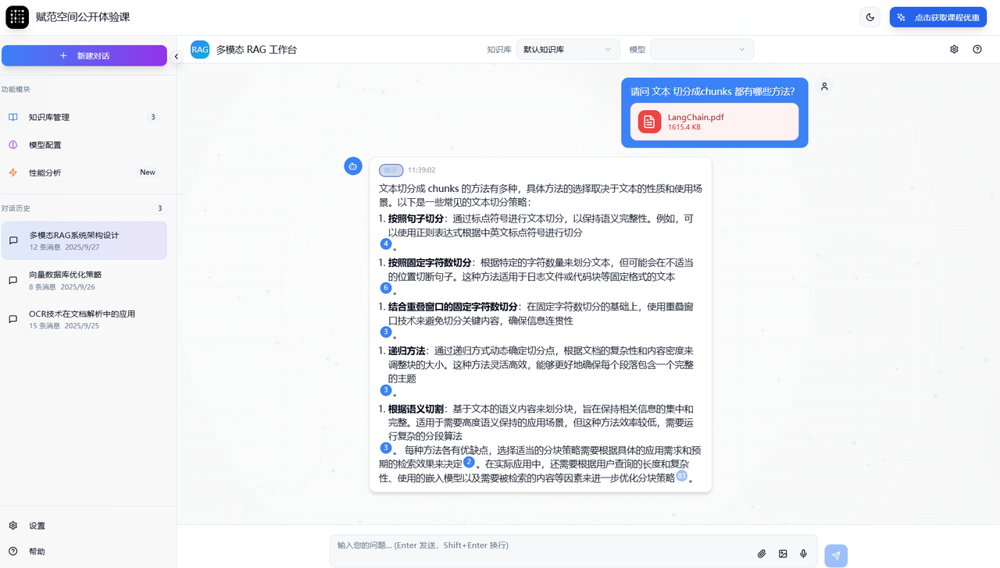
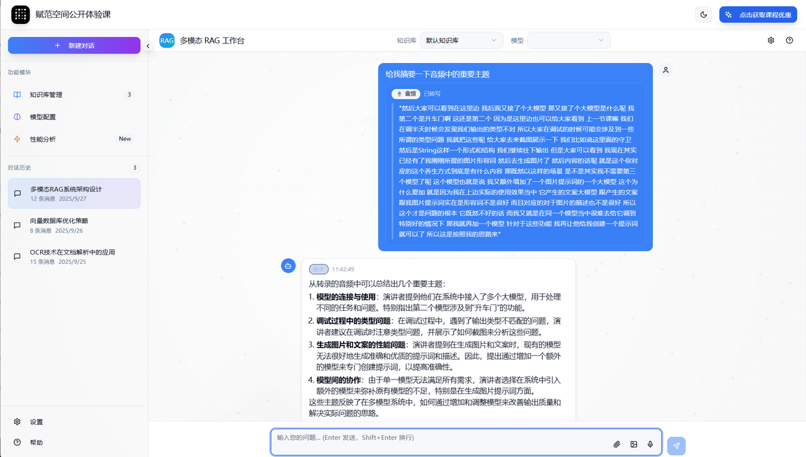

<div align="center"> <h1>🧠多模态 RAG 问答系统（基于 LangChain 1.0）</h1> <p><em>基于 LangChain 1.0 的多模态RAG系统，支持文本、图像、PDF、音频等多种数据格式</em></p> <span>中文 | <a href="./README.md">English</a></span> </div>

## ✨ 项目简介

本项目基于 LangChain 1.0 构建，支持多模态输入、具备可溯源能力的 RAG问答系统。系统采用 FastAPI + React 架构

 

## 🎯 核心功能
🧠 LangChain 1.0 驱动：基于LangChain 1.0，构建统一的多模态知识链路，实现灵活扩展与组件化管理

📎 RAG 溯源角标：生成回答时附带检索引用标识，可直接追溯知识来源，点击角标即可定位至原始文档中对应内容片段

🎧 音频支持：上传音频后自动转录为文本内容，支持问答摘要

⚡ 流式输出：问答结果实时生成与展示，带来更流畅的交互体验

🖥️ 前端交互界面：支持文件上传、问答展示、检索追溯与多模态可视化

## 🎬 项目演示


## 🚀 快速开始

启动后端
```bash
cd backend
uv venv --python 3.10 
source .venv/bin/activate
uv pip install -r requirements.txt
python start.py
```
启动前端
```bash
npm install
npm run dev
```

## 🙈 贡献
欢迎通过GitHub提交 PR 或者issues来对项目进行贡献。我们非常欢迎任何形式的贡献，包括功能改进、bug修复或是文档优化。

## 😎 技术交流
探索我们的技术社区 👉 [大模型技术社区丨赋范空间](https://kq4b3vgg5b.feishu.cn/wiki/JuJSwfbwmiwvbqkiQ7LcN1N1nhd)

扫描添加小可爱，加入技术交流群，与其他小伙伴一起交流学习。
<div align="center">

<div>
